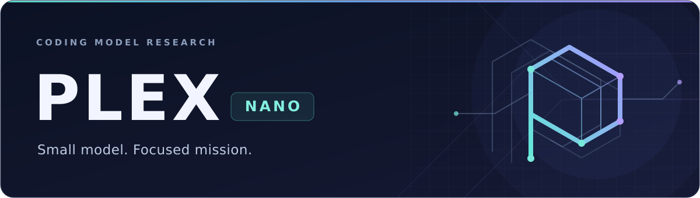
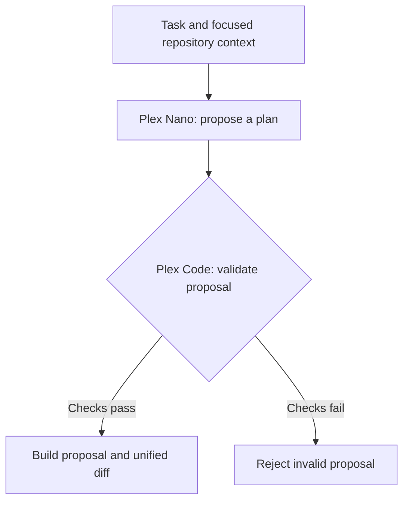

<a id="top"></a>

<p align="center">
  
</p>

<div align="center">

# Plex Nano

**Repository-focused coding research, trained from scratch.**

Small. Local-first. Built around the smallest correct change.


[](LICENSE)

<p>
  <a href="#what-is-plex"><strong>Overview</strong></a>
  ·
  <a href="#current-research-milestone"><strong>Research</strong></a>
  ·
  <a href="#development"><strong>Get Started</strong></a>
  ·
  <a href="./Plex-ROADMAP.md"><strong>Roadmap</strong></a>
  ·
  <a href="./CHANGELOG.md"><strong>Changelog</strong></a>
</p>

<sub>Learned semantic planning + deterministic repository tooling.</sub>

</div>

---

## What is Plex?

Plex is a compact coding-model project built **from the ground up** for repository-focused code editing.

It is not intended to become a general chatbot. The goal is a focused coding engine that can take a task, inspect an existing repository, find the relevant code, understand the local context, make a surgical edit, validate it, and return a clean patch.

> [!NOTE]
> Plex starts from **randomly initialized weights**. It does not use pretrained Qwen weights or another pretrained coding model as its initialization source.

### The core idea

| 01 · Inspect | 02 · Understand | 03 · Propose | 04 · Validate |
|:---|:---|:---|:---|
| Scan the repository and find relevant files | Build focused context for the task | Generate the smallest correct edit | Check the proposal and return a clean diff |

Plex is being built as two connected layers:

| Layer | Purpose |
|---|---|
| **Plex Nano** | Scratch-trained model for semantic normalization, edit intent, target kind/role, bounded search hints, structured planning, checkpoints, and evaluation |
| **Plex Code** | Deterministic repository scanning, exact source resolution, state inspection, edit validation, proposal building, and diff generation |

---

## At a glance

| | Current state |
|---|---|
| **Research model** | 27,566,080 parameters |
| **Context window** | 512 tokens |
| **Primary scope** | HTML, CSS, JavaScript |
| **Training** | From scratch with PyTorch |
| **GPU training** | CUDA working |
| **CPU generation** | Working |
| **Checkpoint resume** | Working |
| **Repository tooling** | Working |
| **General coding ability** | Still being developed |
| **Project phase** | Phase 2 — Basic coding ability |

> [!IMPORTANT]
> Plex can learn supplied examples and its training stack is operational, but it has **not yet demonstrated reliable general coding-task completion on unseen requests**.

---

## How Plex fits together



The repository side is intentionally deterministic. Model output is treated as a **proposal**, not permission to modify files.

---

## Current research milestone

| Research checkpoint | Recorded state |
|:---|:---|
| **Current focus · P2-41** | Request-conditioned plan binding; candidate and tokenizer preflight passed, with the zero-update stage path prepared |
| **Latest diagnostic · P2-40** | Broad categories are emerging; request-specific role, constraint, and hint binding remains unresolved |
| **Latest bridge · P2-39** | **5/18** schema-valid plans · **0/18** complete plans |
| **Next development gate** | Phase 3 remains blocked until the structured-plan bridge succeeds |

[**Current preparation →**](docs/PHASE-2-P2-41-REQUEST-CONDITIONED-PLAN-BINDING.md) · [**Latest diagnostic →**](docs/PHASE-2-P2-40-RESULT.md) · [**Latest bridge result →**](docs/PHASE-2-P2-39-RESULT.md)

### Experiment history

<details>
<summary><strong>P2-17–P2-23 · Early learning and semantic experiments</strong></summary>

### P2-17/P2-17b — semantic binding result

Plex can now completely fit the supplied semantic-binding curriculum, but that capability does **not** transfer cleanly to unseen literals.

By cumulative step **500**:

| Measure | Result |
|---|---:|
| Supplied training complete-task passes | **120 / 120** |
| Training extraction plans | **60 / 60** |
| Training explicit-plan applications | **60 / 60** |
| Tier A full plans | **0 / 20** |
| Tier A selector exact | **0 / 20** |
| Tier A new-value exact | **3 / 20** |
| Tier A operation exact | **13 / 20** |
| Tier A property exact | **15 / 20** |
| Tier B complete | **0 / 20** |
| Tier C complete | **0 / 20** |
| Validation loss | **2.574 → 3.369** from step 100 to 500 |

The current bottleneck is narrower than "CSS generation": Plex learns categorical semantics and memorizes supplied mappings, but it has not yet demonstrated reliable **exact copying/binding of unseen repository literals**.

**Full report:** [P2-17b Semantic Binding Result](docs/PHASE-2-P2-17B-RESULT.md)

### P2-18/P2-18b — literal copy result

P2-18 is now **complete and closed**.

The model increasingly fit the supplied literal-copy curriculum while unseen literal performance stayed at zero:

| Step | Training /144 | Tier A literal /18 | Tier B literal /18 | Tier C selected /18 | Tier D full /18 | Validation loss |
|---:|---:|---:|---:|---:|---:|---:|
| 100 | 4 | 0 | 0 | 0 | 0 | 2.877 |
| 200 | 44 | 0 | 0 | 0 | 0 | 3.039 |
| 300 | 123 | 0 | 0 | 0 | 0 | 3.457 |
| 400 | **132** | **0** | **0** | **0** | **0** | 3.819 |
| 500 | 129 | **0** | **0** | **0** | **0** | 3.790 |

Training Level C reached **36/36**, but held-out selected-field exactness remained **0/18** with **0 wrong-field retrievals**. The model was not merely selecting the wrong contextual value; it was failing to reproduce unseen raw literals at all.

**Full result:** [P2-18b Literal Copy Result](docs/PHASE-2-P2-18B-RESULT.md)

### P2-19/P2-19b — reference binding result

P2-19 is now **complete and closed**.

Reference mediation fixed an important output problem: Plex learned to use stable `R0`–`R5` symbols and reached **14/18** held-out full symbolic plans on Tier D.

But semantic reference selection did not generalize reliably:

| Step | Training /144 | Tier A /18 | Tier B /18 | Tier C /18 | Tier D full /18 | Validation loss |
|---:|---:|---:|---:|---:|---:|---:|
| 100 | 51 | 4 | 6 | 3 | 1 | 3.048 |
| 200 | 116 | 6 | 5 | 2 | 12 | 3.241 |
| 300 | 129 | 8 | 4 | 4 | 11 | 3.549 |
| 400 | 137 | 8 | 6 | 2 | 11 | 3.979 |
| 500 | **143** | 6 | 6 | **2** | **14** | **4.277** |

Training B/C reached **36/36** and **35/36**, while held-out B/C remained weak. The model can manipulate stable references, but semantic role selection and reference lookup are still conflated.

**Full result:** [P2-19b Reference Binding Result](docs/PHASE-2-P2-19B-RESULT.md)

### P2-20/P2-20b — role decomposition result

P2-20 is now **complete and closed**.

| Step | Training /144 | Train A /48 | Train B /48 | Train C /48 | Tier A /24 | Tier B /24 | Tier C /24 | Validation loss |
|---:|---:|---:|---:|---:|---:|---:|---:|---:|
| 100 | 45 | 30 | 8 | 7 | 6 | 4 | 6 | 3.271 |
| 200 | 61 | 34 | 12 | 15 | 2 | 1 | 0 | 3.576 |
| 300 | 84 | 44 | 17 | 23 | 8 | 4 | 4 | 3.827 |
| 400 | 104 | **48** | 25 | 31 | 8 | 5 | 5 | 4.165 |
| 500 | **114** | **48** | 27 | 39 | **12** | **3** | **5** | 3.901 |

Semantic role classification showed the first useful held-out signal: Level A reached 48/48 supplied fit and Tier A reached 12/24. Learned symbolic lookup stayed near chance, so exact reference resolution should move into deterministic Plex Code tooling rather than consume model capacity.

**Full result:** [P2-20b Role Decomposition Result](docs/PHASE-2-P2-20B-RESULT.md)

### P2-21/P2-21b — semantic role result

P2-21 is now **complete and closed**.

| Step | Training /144 | Tier A /24 | Tier B /24 | Tier C /24 | Validation loss |
|---:|---:|---:|---:|---:|---:|
| 100 | 68 | 6 | 8 | 10 | 3.356 |
| 200 | 70 | 8 | 9 | 9 | 3.595 |
| 300 | 113 | 9 | 13 | 12 | 3.844 |
| 400 | 135 | 10 | **15** | **15** | 3.721 |
| 500 | **144** | 9 | **15** | **14** | 4.135 |

The model showed useful semantic transfer under structured and repository-style language, while free paraphrase transfer remained weak. The early `OLD` failure recovered under stronger semantic framing, so it was not a fundamental blind spot.

**Full result:** [P2-21b Semantic Role Continuation Result](docs/PHASE-2-P2-21B-RESULT.md)

### P2-22/P2-22b/P2-22c — edit intent and state-transition result

P2-22 is **complete and closed**.

At step 500, edit-intent classification reached:

```text
Tier A  16 / 25
Tier B  16 / 25
Tier C  18 / 25
Total   50 / 75
```

Final held-out intent accuracy:

```text
REPLACE  12 / 15
INSERT    2 / 15
DELETE   10 / 15
RENAME   15 / 15
TOGGLE   11 / 15
```

P2-22c then tested explicit before/after presence transitions without training the model. It scored **12/45**, below the three-way 15/45 chance baseline. INSERT and DELETE remained poorly separated and both collapsed heavily toward RENAME.

**P2-22b result:** [Edit Intent Continuation Result](docs/PHASE-2-P2-22B-RESULT.md)  
**P2-22c result:** [Presence Transition Diagnostic Result](docs/PHASE-2-P2-22C-RESULT.md)

### P2-23/P2-23b — target-kind classification

P2-23b is **complete and closed** at cumulative step **500**.

| Step | Supplied fit | Tier A | Tier B | Tier C | Held-out total |
|---:|---:|---:|---:|---:|---:|
| 100 | 46/144 | 4/24 | 3/24 | 6/24 | 13/72 |
| 200 | 99/144 | 13/24 | 11/24 | 6/24 | 30/72 |
| 300 | 128/144 | 13/24 | 12/24 | 8/24 | 33/72 |
| 400 | 138/144 | 16/24 | 14/24 | 10/24 | 40/72 |
| 500 | **143/144** | **19/24** | **12/24** | **11/24** | **42/72** |

Step-500 held-out target-kind totals:

```text
CSS_SELECTOR     8 / 12
CSS_PROPERTY     5 / 12
HTML_ELEMENT     8 / 12
HTML_ATTRIBUTE   4 / 12
JS_IDENTIFIER    9 / 12
JS_PROPERTY      8 / 12
```

P2-14 remained **0/12** and P2-01b remained **0/30**. Validation loss rose to **4.34508** while recent training loss fell to **0.06088**, so further optimization of the unchanged P2-23 representation is not planned. The final project holdout remained closed and no continuation beyond step 500 ran.

</details>

<details>
<summary><strong>P2-24–P2-41 · Plex Web and structured-plan research</strong></summary>

The measured P2-23b result led to a larger training-strategy pivot instead of more small-data optimization:

1. **P2-24 — Plex Web Pretraining Specification:** complete.
2. **P2-25 — Corpus Ingestion Pipeline:** complete.
3. **P2-26 — Plex Web Corpus v1:** complete with **3,140 records**, **5,463,479 accepted normalized source bytes**, and a clean contamination report.
4. **P2-27 — Web Tokenizer Review:** complete; the **16,384-token** candidate is frozen for P2-28.
5. **P2-28 — Fresh 27.6M Scratch Pilot:** complete; **100/100 steps**, validation loss **9.8093 → 5.6959**, independently reproduced.
6. **P2-29 — Matched Longer Domain Pretraining:** complete; **500/500 steps**, validation loss **9.8093 → 4.8242**, independently reproduced.
7. **P2-30 — Task-Format Fine-Tuning:** **first bounded run complete**. The authorized 100-step CUDA run improved task validation loss from **6.8210** to a descriptive low of **3.0633 at step 50**, ending at **3.4313 at the fixed step-100 endpoint**. P2-01b remained **0/30 complete tasks**, but truncations fell from **30/30 to 0/30** and the endpoint passed **41/151** static assertions. No continuation is authorized. See the [P2-30 result](docs/PHASE-2-P2-30-FIRST-RUN-RESULT.md).
8. **P2-31 — Structured Coding Bridge:** **development gate failed**. All **18/18** responses were present and untruncated, but **0/18** were schema-valid JSON plans, so complete semantic plans were **0/18** and the fixed gate failed. The failure is classified as a representation-format failure; Phase 3 remains blocked. See the [P2-31 result](docs/PHASE-2-P2-31-RESULT.md).
9. **P2-32 — Structured-Plan Representation Curriculum:** **first bounded run complete**. Preparation passed on the **96-record / 24-group** curriculum (**72 train / 24 validation**) with **96/96 schema-valid targets**, zero P2-31 request/role overlap, frozen 16K tokenizer identity, and a **447-token** maximum record. The run completed **100/100 CUDA updates** and **605,231** real target positions in **106.725s**. Validation improved **8.0029 → 2.9286 → 2.6066 → 2.6039 → 2.6796**; the fixed official endpoint is step 100 with checkpoint SHA `707e46f9...`. See the [P2-32 result](docs/PHASE-2-P2-32-FIRST-RUN-RESULT.md).
10. **P2-33 — Structured Bridge Re-evaluation:** **gate failed**. The fixed P2-32 step-100 endpoint again scored **0/18 complete plans, 0/18 schema-valid plans, 36/162 checks**, with all responses present and untruncated. See the [P2-33 result](docs/PHASE-2-P2-33-RESULT.md).
11. **P2-34 — Output-Boundary Diagnostic:** **complete**. All **18/18** P2-33 responses start with `{`, include `"schemaVersion"`, and end with `}`, but all **18/18** are malformed JSON candidates with no embedded parseable object. The failure is now classified as **interior JSON grammar / serialization instability**. See the [P2-34 result](docs/PHASE-2-P2-34-RESULT.md).
12. **P2-35 — Serialization Stability Curriculum:** **first bounded run complete**. The reviewed **144-record / 24-group** curriculum uses **108 train / 36 validation** records and six linked syntax stages per concept. Local preflight verified **144/144 JSON-object solutions**, **48 strict full plans**, **346-token max record**, **20,427 train / 6,727 validation tokens**, frozen tokenizer identity, zero P2-31 overlap, and zero optimizer updates. The complete stage/preflight packet now pins stage SHA `735554ac...`, bundle SHA `17f02f7f...`, train/validation JSONL and index identities, **299,958** expected real target positions, and baseline validation loss **4.335327882033128**. The run completed **100/100 CUDA updates** and **299,958** real target positions in **21.136s**. Validation moved **4.3353 → 2.3458 → 2.5825 → 2.5264 → 2.6547**; the descriptive low was step 25, while the fixed official endpoint remains step 100 with checkpoint SHA `1fafce16...`. No continuation is authorized. See the [P2-35 result](docs/PHASE-2-P2-35-FIRST-RUN-RESULT.md). See the [curriculum](docs/PHASE-2-P2-35-SERIALIZATION-STABILITY.md) and [training path](docs/PHASE-2-P2-35-TRAINING-PATH.md).

13. **P2-36 — Structured Bridge Re-evaluation:** **gate failed with structural improvement**. The fixed P2-35 endpoint scored **0/18 complete plans, 5/18 schema-valid plans, and 56/162 checks**. Schema-valid plans improved from 0 to 5, but none had the correct targetRole, exact constraints, or required hint coverage. See the [P2-36 result](docs/PHASE-2-P2-36-RESULT.md).
14. **P2-37 — Bridge Error Decomposition:** **complete**. The 18 outputs split into **7 invalid JSON, 6 parseable-but-invalid strict plans, and 5 schema-valid semantic mismatches**. All five schema-valid outputs got language/action/targetKind right but missed targetRole/constraints/hints, and all five reused literal P2-35 target roles. The dominant failure is now classified as **request-conditioned semantic binding / memorized concept collapse**. See the [P2-37 result](docs/PHASE-2-P2-37-RESULT.md).
15. **P2-38 — Semantic-Binding Contrast Curriculum:** **first bounded run complete**. The pinned **108 full-plan records / 36 contrast triplets / 72 train / 36 validation** use the production prompt and have **108 unique requests and target roles**. P2-31 exact-request/role and P2-35 role overlap are each **zero**. Frozen-tokenizer preflight passed at **395 tokens maximum including EOS**, with **24,793 train / 12,409 validation tokens**. The approved packet preserves bundle SHA `9a69a848...`, stage SHA `325d37ad...`, train/validation JSONL SHAs `ecff52a7...` / `ed643f97...`, train/validation index SHAs `a7537717...` / `310abdf3...`, **548,680** expected real target positions at 100 steps, and baseline validation loss **2.6659477899471917**. The run completed **100/100 CUDA updates** and **548,680** real target positions in **21.426s**. Validation moved **2.66595 → 2.33000 → 2.55712 → 2.60249 → 2.62592**; the descriptive low was step 25, while the fixed official endpoint remains step 100 with checkpoint SHA `9117e344...`. No continuation is authorized. See the [P2-38 result](docs/PHASE-2-P2-38-FIRST-RUN-RESULT.md). See the [curriculum](docs/PHASE-2-P2-38-SEMANTIC-BINDING.md) and [training path](docs/PHASE-2-P2-38-TRAINING-PATH.md).

16. **P2-39 — Structured Bridge Re-evaluation:** **gate failed with no net bridge improvement**. The fixed P2-38 endpoint scored **0/18 complete plans, 5/18 schema-valid plans, and 54/162 checks** versus P2-36's **0/18, 5/18, 56/162**. See the [P2-39 result](docs/PHASE-2-P2-39-RESULT.md).
17. **P2-40 — Bridge Error Decomposition:** **diagnostic complete**. The exact P2-39 responses split into **9 invalid JSON, 4 parseable-but-invalid strict plans, and 5 schema-valid semantic mismatches**. Among schema-valid outputs, language and targetKind were **5/5**, action **3/5**, while targetRole, exact constraints, and hint coverage remained **0/5**. The result confirms emerging broad-category recognition but persistent request-conditioned semantic-template substitution plus residual serialization instability. No training occurred and the final holdout remained closed. See the [P2-40 result](docs/PHASE-2-P2-40-RESULT.md).
18. **P2-41 — Request-Conditioned Plan Binding:** **candidate + tokenizer preflight passed; zero-update stage path prepared**. The frozen **108-record / 36-group / 72-train / 36-validation** candidate has SHA `20f30918...`, zero P2-31 request/role/expected-plan overlap, and four isolated contrast families. Frozen-tokenizer preflight passed at **374 tokens maximum**, **25,599 train tokens**, and **12,798 validation tokens**. Pack/stage/preflight commands now exist and stage from the fixed P2-38 step-100 checkpoint `9117e344...`; there is deliberately **no P2-41 training command yet**. The previously reported **281-test** full-suite pass predates the latest execution-path regressions, so current `master` still needs one fresh local test run before the zero-update packet is measured. See [P2-41](docs/PHASE-2-P2-41-REQUEST-CONDITIONED-PLAN-BINDING.md).

</details>

The architecture split remains: **Plex Nano owns learned web-code priors and semantic planning; Plex Code owns exact repository lookup, state resolution, mutation, validation, and diff generation.**

### New training direction — Plex Web

P2-23b showed that the small scratch model can learn useful task semantics, but the broader coding benchmark still lacks a strong underlying code prior. Phase 2 therefore moves to **domain pretraining first, task-format fine-tuning second**.

| Stage | Purpose |
|:---|:---|
| **01 · Web corpus** | Permissively licensed HTML, CSS, and JavaScript |
| **02 · Domain pretraining** | Build code knowledge through Plex Web Base pretraining |
| **03 · Task-format fine-tuning** | Train the model to express structured edit plans |
| **04 · Repository resolution** | Use Plex Code for deterministic source lookup and validation |

The current 27.6M model remains the first controlled pretraining architecture. Scaling toward the longer-term 0.5B–1.5B range is deferred until the corpus, tokenizer, and pretraining measurements justify it.

See [P2-24 Plex Web Pretraining Specification](docs/PHASE-2-P2-24-WEB-PRETRAINING-SPEC.md), [P2-25 closeout](docs/PHASE-2-P2-25-CLOSEOUT.md), [P2-26 closeout](docs/PHASE-2-P2-26-CLOSEOUT.md), [P2-27 result](docs/PHASE-2-P2-27-RESULT.md), [P2-28 result](docs/PHASE-2-P2-28-RESULT.md), [P2-29 result](docs/PHASE-2-P2-29-RESULT.md), [P2-30 result](docs/PHASE-2-P2-30-FIRST-RUN-RESULT.md), [P2-31 result](docs/PHASE-2-P2-31-RESULT.md), and [P2-32 preparation](docs/PHASE-2-P2-32-STRUCTURED-PLAN-CURRICULUM.md).

**Result:** [P2-23b Target-Kind Continuation Result](docs/PHASE-2-P2-23B-RESULT.md)  
**Continuation contract:** [P2-23b Target-Kind Continuation](docs/PHASE-2-P2-23B-CONTINUATION.md)

---

## What already works

### Repository tooling

Plex Code can already:

- safely scan supported repositories
- discover HTML, CSS, JavaScript, MJS, and CJS files
- rank likely target files from the task
- build bounded model context
- validate strict structured model responses
- validate edit paths and anchors
- build proposed buffers without modifying the original source
- generate unified diffs
- preserve UTF-8 BOMs and newline styles
- detect changed source snapshots before trusting an edit

### Training stack

Plex Nano can already:

- initialize a model from random weights
- train locally with PyTorch
- run CUDA training
- save model checkpoints
- resume training from checkpoints
- preserve optimizer and RNG state
- evaluate saved checkpoints
- generate text on CPU
- track tokenizer, dataset, model, and checkpoint provenance

---

## What Plex cannot do yet

Plex is still an experimental research model.

It has **not** yet proven that it can:

- reliably solve unseen coding tasks
- complete a real repository edit end-to-end using its trained model
- pass the final held-out coding benchmark
- safely make autonomous repository changes
- replace a production coding assistant

The final project holdout remains closed while the training strategy is still being developed.

---

## Roadmap

The full plan lives in [Plex-ROADMAP.md](Plex-ROADMAP.md).

| Phase | Goal | Status |
|---|---|---|
| **Phase 1** | Build repository tooling and prove scratch training works | **Complete** |
| **Phase 2** | Pretrain on permissively licensed web code, then fine-tune task semantics | **Active — Plex Web program** |
| **Phase 3** | Connect the tuned Plex semantic planner to repository editing | **Blocked pending a successful post-P2-32 structured-plan bridge gate** |
| **Phase 4** | Scale, optimize, quantize, and prepare a local release | **Later** |

### Long-term direction

The intended Plex family is a lightweight local coding-model family that can scale toward roughly **0.5B–1.5B parameters** when the measured results justify it.

The release target is:

- local Windows operation
- CPU-capable inference
- optional GPU acceleration
- practical quantization, including a 4-bit candidate where useful
- no cloud dependency for normal use
- repository-native coding instead of general-purpose conversation

The current **27.6M-parameter** model is the research foundation used to prove the architecture, data strategy, evaluation process, and coding workflow before attempting that larger scale.

---

## Development

### Repository tooling

Requires **Node.js 24 LTS**.

```powershell
npm ci
npm run build
npm test
npm start -- --help
```

<details>
<summary><strong>Test the packaged CLI locally</strong></summary>

```powershell
npm pack
npm install --prefix ".test-artifacts\local install" --omit=dev --ignore-scripts --no-audit --no-fund .\plex-code-cli-0.1.0.tgz
& ".\.test-artifacts\local install\node_modules\.bin\plex.cmd" --help
```

The package is private to prevent accidental registry publication.

</details>

### Training

The separate Python training workspace lives in:

```text
training/
```

Start with [training/README.md](training/README.md) for preparation, training, evaluation, and checkpoint commands.

---

## Repository map

| Location | What you will find |
|:---|:---|
| [`src/`](src/) | Plex Code repository tooling |
| [`training/`](training/) | Scratch model training and evaluation |
| [`docs/`](docs/) | Experiment reports and technical notes |
| [`fixtures/`](fixtures/) | Small repositories used by tests |
| [`prompts/`](prompts/) | Packaged model instructions |
| [`tests/`](tests/) | Tooling tests |
| [`Plex-ROADMAP.md`](Plex-ROADMAP.md) | Full development roadmap |
| [`CHANGELOG.md`](CHANGELOG.md) | Historical implementation changes |
| [`README.md`](README.md) | Project overview |

---

## Design principles

Plex development follows a few strict rules:

1. **Train from scratch.**
2. **Keep the model small until measurements justify scaling.**
3. **Optimize for coding, not general conversation.**
4. **Separate training loss from actual coding-task success.**
5. **Protect final evaluation data from training decisions.**
6. **Treat generated edits as proposals until deterministic checks pass.**
7. **Preserve experiment provenance and reproducibility.**
8. **Report failed experiments instead of hiding them.**

---

## Reports

For the technical details and experiment history:

- [Full Plex roadmap](Plex-ROADMAP.md)
- [P2-23b target-kind continuation result](docs/PHASE-2-P2-23B-RESULT.md)
- [P2-17b semantic binding result](docs/PHASE-2-P2-17B-RESULT.md)
- [P2-18 literal copy candidate review](training/phase2/drafts/p2-18-literal-copy-candidate-v1/REVIEW.md)
- [P2-16 CSS generalization result](docs/PHASE-2-P2-16-RESULT.md)
- [P2-16b optimization continuation](docs/PHASE-2-P2-16B-CONTINUATION.md)
- [Phase 1 experiment report](docs/PLEX-EXPERIMENT-REPORT-P1-20.md)
- [Hardware and training profile](docs/HARDWARE-AND-TRAINING-PROFILE.md)
- [Training workspace](training/README.md)
- [Changelog](CHANGELOG.md)

---

<div align="center">

### Built small on purpose.

**Plex is a working scratch-training research project with a real repository-editing foundation — not yet a finished coding model.**

</div>

## License

The code is licensed under the [MIT License](LICENSE). The training corpus has
its own source and license records in [source-policy.json](training/pretraining/source-policy.json);
review those records before reusing corpus material.

---

<p align="center">
  <strong>Plex Nano</strong> · Built small on purpose.<br>
  <a href="#top">Back to top</a> · <a href="./Plex-ROADMAP.md">Follow the roadmap</a> · <a href="./training/README.md">Explore training</a>
</p>
