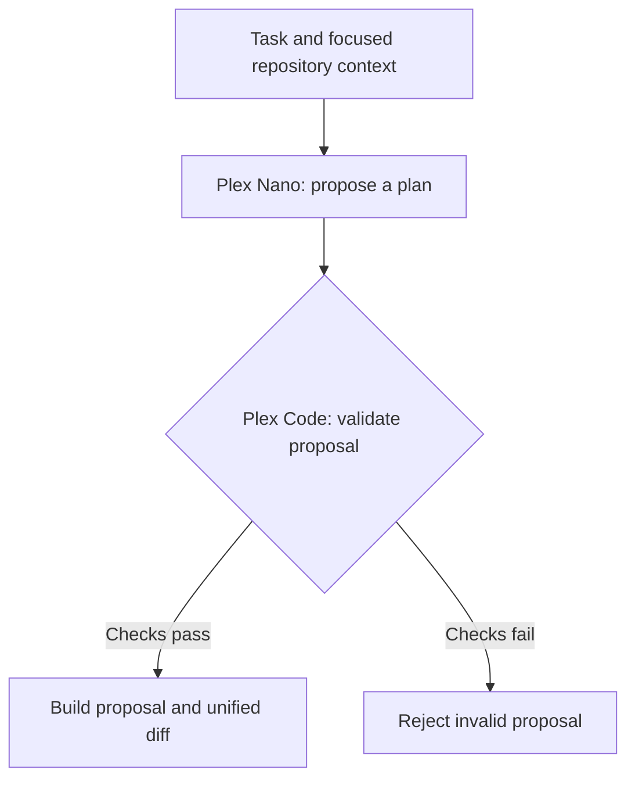

<a id="top"></a>

<p align="center">
  
</p>

<div align="center">

# Plex Nano

**Repository-focused coding research, trained from scratch.**

Small. Local-first. Built around the smallest correct change.


[](LICENSE)

<p>
  <a href="#what-is-plex"><strong>Overview</strong></a>
  ·
  <a href="#current-research-milestone"><strong>Research</strong></a>
  ·
  <a href="#development"><strong>Get Started</strong></a>
  ·
  <a href="./Plex-ROADMAP.md"><strong>Roadmap</strong></a>
  ·
  <a href="./CHANGELOG.md"><strong>Changelog</strong></a>
</p>

<sub>Experimental semantic planning + deterministic repository tooling.</sub>

</div>

---

## What is Plex?

Plex is a compact coding-model project built **from the ground up** for repository-focused code editing.

It is not intended to become a general chatbot. The goal is a focused coding engine that can take a task, inspect an existing repository, find the relevant code, understand the local context, make a surgical edit, validate it, and return a clean patch.

> [!NOTE]
> Plex starts from **randomly initialized weights**. It does not use pretrained Qwen weights or another pretrained coding model as its initialization source.

### The core idea

| 01 · Inspect | 02 · Understand | 03 · Propose | 04 · Validate |
|:---|:---|:---|:---|
| Scan the repository and find relevant files | Build focused context for the task | Generate the smallest correct edit | Check the proposal and return a clean diff |

Plex is being built as two connected layers:

| Layer | Purpose |
|---|---|
| **Plex Nano** | Scratch-trained model for semantic normalization, edit intent, target kind/role, bounded search hints, structured planning, checkpoints, and evaluation |
| **Plex Code** | Deterministic repository scanning, exact source resolution, state inspection, edit validation, proposal building, and diff generation |

---

## At a glance

| | Current state |
|---|---|
| **Research model** | 27,566,080 parameters |
| **Context window** | 512 tokens |
| **Primary scope** | HTML, CSS, JavaScript |
| **Training** | From scratch with PyTorch |
| **GPU training** | CUDA working |
| **CPU generation** | Working |
| **Checkpoint resume** | Working |
| **Repository tooling** | Working |
| **General coding ability** | Still being developed |
| **Project phase** | Phase 2 — structured-plan bridge |

> [!IMPORTANT]
> Plex can learn supplied examples and its training stack is operational, but it has **not yet demonstrated reliable general coding-task completion on unseen requests**.

### Project status in 30 seconds

| | Status |
|---|---|
| **What works** | Local training and checkpoint workflows; deterministic repository scanning, edit validation, and diff generation |
| **What is experimental** | Plex Nano's ability to turn an unseen request into a complete, machine-readable edit plan |
| **What is not proven** | End-to-end coding success on unseen repository tasks |
| **What happens next** | P2-45 is prepared to evaluate the fixed P2-44 checkpoint against the unchanged development bridge gate; it does not train the model |

---

## How Plex fits together



The repository side is intentionally deterministic. Model output is treated as a **proposal**, not permission to modify files.

---

## Current research milestone

| Research checkpoint | Recorded state |
|:---|:---|
| **Current focus · P2-45** | Evaluation-only recheck of the fixed P2-44 step-100 checkpoint; no training is authorized |
| **Latest semantic diagnostic · P2-43** | **17/18** schema-valid plans, but **0/18** complete semantic plans; training-template reuse remained high |
| **Latest training endpoint · P2-44** | Evidence-first semantic-composition run; fixed step-100 checkpoint awaits the P2-45 evaluation |
| **Phase 3 gate** | Blocked until the unchanged development gate reaches **12/18** complete plans, at least **3/6 per language**, and **15/18** schema-valid plans |

[**P2-45 evaluation plan →**](docs/PHASE-2-P2-45-STRUCTURED-BRIDGE-REEVALUATION.md) · [**P2-44 curriculum →**](docs/PHASE-2-P2-44-EVIDENCE-FIRST-SEMANTIC-COMPOSITION.md) · [**Latest diagnostic →**](docs/PHASE-2-P2-43-RESULT.md)

### Experiment history

<details>
<summary><strong>P2-17–P2-23 · Early learning and semantic experiments</strong></summary>

### P2-17/P2-17b — semantic binding result

The model fit the supplied curriculum (**120/120** complete training tasks), but held-out complete plans remained **0/20** and exact copying of unseen repository literals was unreliable.

**Full report:** [P2-17b Semantic Binding Result](docs/PHASE-2-P2-17B-RESULT.md)

### P2-18/P2-18b — literal copy result

P2-18 is now **complete and closed**.

The model fit more of its supplied literal-copy examples, but held-out selected-field exactness remained **0/18**.

**Full result:** [P2-18b Literal Copy Result](docs/PHASE-2-P2-18B-RESULT.md)

### P2-19/P2-19b — reference binding result

P2-19 is now **complete and closed**.

Reference mediation enabled **14/18** held-out symbolic plans on one tier, but semantic reference selection still generalized poorly.

**Full result:** [P2-19b Reference Binding Result](docs/PHASE-2-P2-19B-RESULT.md)

### P2-20/P2-20b — role decomposition result

P2-20 is now **complete and closed**.

Semantic role classification produced an early held-out signal (**12/24** on Tier A), while learned symbolic lookup remained weak.

**Full result:** [P2-20b Role Decomposition Result](docs/PHASE-2-P2-20B-RESULT.md)

### P2-21/P2-21b — semantic role result

P2-21 is now **complete and closed**.

The model showed some transfer with structured, repository-style wording; free-paraphrase transfer remained weak.

**Full result:** [P2-21b Semantic Role Continuation Result](docs/PHASE-2-P2-21B-RESULT.md)

### P2-22/P2-22b/P2-22c — edit intent and state-transition result

P2-22 is **complete and closed**.

At step 500, edit-intent classification reached **50/75**. A separate no-training presence-transition diagnostic scored **12/45**, below the **15/45** three-way chance baseline.

**P2-22b result:** [Edit Intent Continuation Result](docs/PHASE-2-P2-22B-RESULT.md)  
**P2-22c result:** [Presence Transition Diagnostic Result](docs/PHASE-2-P2-22C-RESULT.md)

### P2-23/P2-23b — target-kind classification

P2-23b is **complete and closed** at cumulative step **500**.

At step 500, held-out target-kind classification reached **42/72**, but P2-14 remained **0/12** and P2-01b **0/30**. Training loss continued falling as validation loss rose, so the unchanged setup was not continued.

</details>

<details>
<summary><strong>P2-24–P2-45 · Plex Web and structured-plan research</strong></summary>

The work since P2-23 shifted from domain pretraining to structured-plan generation. The key result so far is that better formatting did not by itself produce correct request-specific semantics.

| Milestones | Takeaway |
|---|---|
| **P2-24–29 · Plex Web base** | Built a reviewed web-code corpus and tokenizer, then completed a 500-step scratch pretraining run. Validation loss improved **9.8093 → 4.8242**; this did not establish coding-task success. See the [P2-26 corpus closeout](docs/PHASE-2-P2-26-CLOSEOUT.md) and [P2-29 result](docs/PHASE-2-P2-29-RESULT.md). |
| **P2-30–34 · First structured bridge** | Fine-tuning reduced truncation, but P2-31 produced **0/18** schema-valid plans; follow-up work localized the main issue to serialization. See the [P2-30 result](docs/PHASE-2-P2-30-FIRST-RUN-RESULT.md), [P2-31 result](docs/PHASE-2-P2-31-RESULT.md), and [P2-34 diagnostic](docs/PHASE-2-P2-34-RESULT.md). |
| **P2-35–40 · Serialization and semantic binding** | The bridge improved to **5/18** schema-valid plans, but still had **0/18** complete plans. Analysis found both malformed output and reuse of training-set semantic templates. See the [P2-36 result](docs/PHASE-2-P2-36-RESULT.md), [P2-39 result](docs/PHASE-2-P2-39-RESULT.md), and [P2-40 diagnostic](docs/PHASE-2-P2-40-RESULT.md). |
| **P2-41–43 · Request-conditioned binding** | P2-41 raised schema validity to **17/18** but complete semantic passes remained **0/18**; P2-43 traced many errors to training-template reuse. See the [P2-43 diagnostic](docs/PHASE-2-P2-43-RESULT.md). |
| **P2-44–45 · Evidence-first composition** | P2-44 trained a bounded evidence-first curriculum. P2-45's evaluation plan is prepared, but its result is not yet recorded here. It is evaluation-only: no training or final-holdout access is authorized. See the [P2-44 curriculum](docs/PHASE-2-P2-44-EVIDENCE-FIRST-SEMANTIC-COMPOSITION.md) and [P2-45 evaluation plan](docs/PHASE-2-P2-45-STRUCTURED-BRIDGE-REEVALUATION.md). |

</details>

The architecture split remains: **Plex Nano owns learned web-code priors and semantic planning; Plex Code owns exact repository lookup, state resolution, mutation, validation, and diff generation.**

### New training direction — Plex Web

P2-23b showed that the small scratch model can learn useful task semantics, but the broader coding benchmark still lacks a strong underlying code prior. Phase 2 therefore moves to **domain pretraining first, task-format fine-tuning second**.

| Stage | Purpose |
|:---|:---|
| **01 · Web corpus** | Permissively licensed HTML, CSS, and JavaScript |
| **02 · Domain pretraining** | Build code knowledge through Plex Web Base pretraining |
| **03 · Task-format fine-tuning** | Train the model to express structured edit plans |
| **04 · Repository resolution** | Use Plex Code for deterministic source lookup and validation |

The current 27.6M model remains the first controlled pretraining architecture. Scaling toward the longer-term 0.5B–1.5B range is deferred until the corpus, tokenizer, and pretraining measurements justify it.

See [P2-24 Plex Web Pretraining Specification](docs/PHASE-2-P2-24-WEB-PRETRAINING-SPEC.md), [P2-25 closeout](docs/PHASE-2-P2-25-CLOSEOUT.md), [P2-26 closeout](docs/PHASE-2-P2-26-CLOSEOUT.md), [P2-27 result](docs/PHASE-2-P2-27-RESULT.md), [P2-28 result](docs/PHASE-2-P2-28-RESULT.md), [P2-29 result](docs/PHASE-2-P2-29-RESULT.md), [P2-30 result](docs/PHASE-2-P2-30-FIRST-RUN-RESULT.md), [P2-31 result](docs/PHASE-2-P2-31-RESULT.md), and [P2-32 preparation](docs/PHASE-2-P2-32-STRUCTURED-PLAN-CURRICULUM.md).

**Result:** [P2-23b Target-Kind Continuation Result](docs/PHASE-2-P2-23B-RESULT.md)  
**Continuation contract:** [P2-23b Target-Kind Continuation](docs/PHASE-2-P2-23B-CONTINUATION.md)

---

## What already works

### Repository tooling

Plex Code can already:

- safely scan supported repositories
- discover HTML, CSS, JavaScript, MJS, and CJS files
- rank likely target files from the task
- build bounded model context
- validate strict structured model responses
- validate edit paths and anchors
- build proposed buffers without modifying the original source
- generate unified diffs
- preserve UTF-8 BOMs and newline styles
- detect changed source snapshots before trusting an edit

### Training stack

Plex Nano can already:

- initialize a model from random weights
- train locally with PyTorch
- run CUDA training
- save model checkpoints
- resume training from checkpoints
- preserve optimizer and RNG state
- evaluate saved checkpoints
- generate text on CPU
- track tokenizer, dataset, model, and checkpoint provenance

---

## What Plex cannot do yet

Plex is still an experimental research model.

It has **not** yet proven that it can:

- reliably solve unseen coding tasks
- complete a real repository edit end-to-end using its trained model
- pass the final held-out coding benchmark
- safely make autonomous repository changes
- replace a production coding assistant

The final project holdout remains closed while the training strategy is still being developed.

---

## Roadmap

The full plan lives in [Plex-ROADMAP.md](Plex-ROADMAP.md).

| Phase | Goal | Status |
|---|---|---|
| **Phase 1** | Build repository tooling and prove scratch training works | **Complete** |
| **Phase 2** | Pretrain on permissively licensed web code, then fine-tune task semantics | **Active — Plex Web program** |
| **Phase 3** | Connect the tuned Plex semantic planner to repository editing | **Blocked until the fixed bridge gate passes: 12/18 complete, ≥3/6 per language, and 15/18 schema-valid** |
| **Phase 4** | Scale, optimize, quantize, and prepare a local release | **Later** |

### Long-term direction

The intended Plex family is a lightweight local coding-model family that can scale toward roughly **0.5B–1.5B parameters** when the measured results justify it.

The release target is:

- local Windows operation
- CPU-capable inference
- optional GPU acceleration
- practical quantization, including a 4-bit candidate where useful
- no cloud dependency for normal use
- repository-native coding instead of general-purpose conversation

The current **27.6M-parameter** model is the research foundation used to prove the architecture, data strategy, evaluation process, and coding workflow before attempting that larger scale.

---

## Development

Choose the path that matches what you want to do:

| Goal | Start here |
|---|---|
| **Build or change repository tooling** | Node.js 24; install dependencies and run the Node test suite below |
| **Inspect or reproduce model experiments** | The separate Python workspace; follow [`training/README.md`](training/README.md) and the specific milestone report |
| **Understand the project before changing code** | Read the [roadmap](Plex-ROADMAP.md), then check the current milestone and its linked report above |

### Repository tooling — Node.js

Requires **Node.js 24**. From the repository root:

```powershell
npm ci
npm run build
npm test
npm start -- --help
```

For a tooling change, run the relevant tests before opening a change; `npm test` runs the full Node suite. The CLI currently focuses on safe repository inspection and validated **proposals**—it does not autonomously apply edits.

<details>
<summary><strong>Test the packaged CLI locally</strong></summary>

```powershell
npm pack
npm install --prefix ".test-artifacts\local install" --omit=dev --ignore-scripts --no-audit --no-fund .\plex-code-cli-0.1.0.tgz
& ".\.test-artifacts\local install\node_modules\.bin\plex.cmd" --help
```

The package is private to prevent accidental registry publication.

</details>

### Model research — Python

The training workspace is separate from the Node.js repository tooling and lives in:

```text
training/
```

Use the documented Python 3.12 environment managed by `uv`:

```powershell
uv sync --project training
uv run --project training python -m plex_training.cli environment
```

Start with [training/README.md](training/README.md) for experiment preparation, bounded runs, evaluation, and checkpoint commands. A preparation or preflight command is not training authorization; follow the approval status in the relevant milestone contract.

---

## Repository map

| Location | What you will find |
|:---|:---|
| [`src/`](src/) | Plex Code repository tooling |
| [`training/`](training/) | Scratch model training and evaluation |
| [`docs/`](docs/) | Experiment reports and technical notes |
| [`fixtures/`](fixtures/) | Small repositories used by tests |
| [`prompts/`](prompts/) | Packaged model instructions |
| [`tests/`](tests/) | Tooling tests |
| [`Plex-ROADMAP.md`](Plex-ROADMAP.md) | Full development roadmap |
| [`CHANGELOG.md`](CHANGELOG.md) | Historical implementation changes |
| [`README.md`](README.md) | Project overview |

---

## Design principles

Plex development follows a few strict rules:

1. **Train from scratch.**
2. **Keep the model small until measurements justify scaling.**
3. **Optimize for coding, not general conversation.**
4. **Separate training loss from actual coding-task success.**
5. **Protect final evaluation data from training decisions.**
6. **Treat generated edits as proposals until deterministic checks pass.**
7. **Preserve experiment provenance and reproducibility.**
8. **Report failed experiments instead of hiding them.**

---

## Reports

For the technical details and experiment history:

- [Full Plex roadmap](Plex-ROADMAP.md)
- [P2-23b target-kind continuation result](docs/PHASE-2-P2-23B-RESULT.md)
- [P2-17b semantic binding result](docs/PHASE-2-P2-17B-RESULT.md)
- [P2-18 literal copy candidate review](training/phase2/drafts/p2-18-literal-copy-candidate-v1/REVIEW.md)
- [P2-16 CSS generalization result](docs/PHASE-2-P2-16-RESULT.md)
- [P2-16b optimization continuation](docs/PHASE-2-P2-16B-CONTINUATION.md)
- [Phase 1 experiment report](docs/PLEX-EXPERIMENT-REPORT-P1-20.md)
- [Hardware and training profile](docs/HARDWARE-AND-TRAINING-PROFILE.md)
- [Training workspace](training/README.md)
- [Changelog](CHANGELOG.md)

---

<div align="center">

### Built small on purpose.

**Plex is a working scratch-training research project with a real repository-editing foundation — not yet a finished coding model.**

</div>

## License

The code is licensed under the [MIT License](LICENSE). The training corpus has
its own source and license records in [source-policy.json](training/pretraining/source-policy.json);
review those records before reusing corpus material.

---

<p align="center">
  <strong>Plex Nano</strong> · Built small on purpose.<br>
  <a href="#top">Back to top</a> · <a href="./Plex-ROADMAP.md">Follow the roadmap</a> · <a href="./training/README.md">Explore training</a>
</p>
