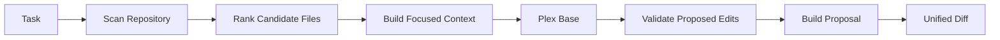

<div align="center">

# Plex Base

### Repository-native coding intelligence, trained from scratch.

**Small. Local-first. Focused on making the smallest correct change.**


<p>
  <a href="./Plex-ROADMAP.md"><strong>Roadmap</strong></a>
  ·
  <a href="./training/README.md"><strong>Training</strong></a>
  ·
  <a href="./docs/PHASE-2-P2-21B-RESULT.md"><strong>Latest Result</strong></a>
  ·
  <a href="./CHANGELOG.md"><strong>Changelog</strong></a>
</p>

</div>

---

## What is Plex?

Plex is a compact coding-model project built **from the ground up** for repository-focused code editing.

It is not intended to become a general chatbot. The goal is a focused coding engine that can take a task, inspect an existing repository, find the relevant code, understand the local context, make a surgical edit, validate it, and return a clean patch.

> [!NOTE]
> Plex starts from **randomly initialized weights**. It does not use pretrained Qwen weights or another pretrained coding model as its initialization source.

### The core idea

```text
TASK
  ↓
INSPECT REPOSITORY
  ↓
FIND RELEVANT FILES
  ↓
BUILD FOCUSED CONTEXT
  ↓
GENERATE THE SMALLEST CORRECT EDIT
  ↓
VALIDATE
  ↓
RETURN A CLEAN DIFF
```

Plex is being built as two connected layers:

| Layer | Purpose |
|---|---|
| **Plex Base** | Model architecture, tokenizer, datasets, checkpoints, training, and evaluation |
| **Plex Code** | Repository scanning, file ranking, context construction, edit validation, proposal building, and diff generation |

---

## At a glance

| | Current state |
|---|---|
| **Research model** | 27,566,080 parameters |
| **Context window** | 512 tokens |
| **Primary scope** | HTML, CSS, JavaScript |
| **Training** | From scratch with PyTorch |
| **GPU training** | CUDA working |
| **CPU generation** | Working |
| **Checkpoint resume** | Working |
| **Repository tooling** | Working |
| **General coding ability** | Still being developed |
| **Project phase** | Phase 2 — Basic coding ability |

> [!IMPORTANT]
> Plex can learn supplied examples and its training stack is operational, but it has **not yet demonstrated reliable general coding-task completion on unseen requests**.

---

## How Plex fits together



The repository side is intentionally deterministic. Model output is treated as a **proposal**, not permission to modify files.

---

## Current research milestone

### P2-17/P2-17b — semantic binding result

Plex can now completely fit the supplied semantic-binding curriculum, but that capability does **not** transfer cleanly to unseen literals.

By cumulative step **500**:

| Measure | Result |
|---|---:|
| Supplied training complete-task passes | **120 / 120** |
| Training extraction plans | **60 / 60** |
| Training explicit-plan applications | **60 / 60** |
| Tier A full plans | **0 / 20** |
| Tier A selector exact | **0 / 20** |
| Tier A new-value exact | **3 / 20** |
| Tier A operation exact | **13 / 20** |
| Tier A property exact | **15 / 20** |
| Tier B complete | **0 / 20** |
| Tier C complete | **0 / 20** |
| Validation loss | **2.574 → 3.369** from step 100 to 500 |

The current bottleneck is narrower than "CSS generation": Plex learns categorical semantics and memorizes supplied mappings, but it has not yet demonstrated reliable **exact copying/binding of unseen repository literals**.

**Full report:** [P2-17b Semantic Binding Result](docs/PHASE-2-P2-17B-RESULT.md)

### P2-18/P2-18b — literal copy result

P2-18 is now **complete and closed**.

The model increasingly fit the supplied literal-copy curriculum while unseen literal performance stayed at zero:

| Step | Training /144 | Tier A literal /18 | Tier B literal /18 | Tier C selected /18 | Tier D full /18 | Validation loss |
|---:|---:|---:|---:|---:|---:|---:|
| 100 | 4 | 0 | 0 | 0 | 0 | 2.877 |
| 200 | 44 | 0 | 0 | 0 | 0 | 3.039 |
| 300 | 123 | 0 | 0 | 0 | 0 | 3.457 |
| 400 | **132** | **0** | **0** | **0** | **0** | 3.819 |
| 500 | 129 | **0** | **0** | **0** | **0** | 3.790 |

Training Level C reached **36/36**, but held-out selected-field exactness remained **0/18** with **0 wrong-field retrievals**. The model was not merely selecting the wrong contextual value; it was failing to reproduce unseen raw literals at all.

**Full result:** [P2-18b Literal Copy Result](docs/PHASE-2-P2-18B-RESULT.md)

### P2-19/P2-19b — reference binding result

P2-19 is now **complete and closed**.

Reference mediation fixed an important output problem: Plex learned to use stable `R0`–`R5` symbols and reached **14/18** held-out full symbolic plans on Tier D.

But semantic reference selection did not generalize reliably:

| Step | Training /144 | Tier A /18 | Tier B /18 | Tier C /18 | Tier D full /18 | Validation loss |
|---:|---:|---:|---:|---:|---:|---:|
| 100 | 51 | 4 | 6 | 3 | 1 | 3.048 |
| 200 | 116 | 6 | 5 | 2 | 12 | 3.241 |
| 300 | 129 | 8 | 4 | 4 | 11 | 3.549 |
| 400 | 137 | 8 | 6 | 2 | 11 | 3.979 |
| 500 | **143** | 6 | 6 | **2** | **14** | **4.277** |

Training B/C reached **36/36** and **35/36**, while held-out B/C remained weak. The model can manipulate stable references, but semantic role selection and reference lookup are still conflated.

**Full result:** [P2-19b Reference Binding Result](docs/PHASE-2-P2-19B-RESULT.md)

### P2-20/P2-20b — role decomposition result

P2-20 is now **complete and closed**.

| Step | Training /144 | Train A /48 | Train B /48 | Train C /48 | Tier A /24 | Tier B /24 | Tier C /24 | Validation loss |
|---:|---:|---:|---:|---:|---:|---:|---:|---:|
| 100 | 45 | 30 | 8 | 7 | 6 | 4 | 6 | 3.271 |
| 200 | 61 | 34 | 12 | 15 | 2 | 1 | 0 | 3.576 |
| 300 | 84 | 44 | 17 | 23 | 8 | 4 | 4 | 3.827 |
| 400 | 104 | **48** | 25 | 31 | 8 | 5 | 5 | 4.165 |
| 500 | **114** | **48** | 27 | 39 | **12** | **3** | **5** | 3.901 |

Semantic role classification showed the first useful held-out signal: Level A reached 48/48 supplied fit and Tier A reached 12/24. Learned symbolic lookup stayed near chance, so exact reference resolution should move into deterministic Plex Code tooling rather than consume model capacity.

**Full result:** [P2-20b Role Decomposition Result](docs/PHASE-2-P2-20B-RESULT.md)

### P2-21/P2-21b — semantic role result

P2-21 is now **complete and closed**.

| Step | Training /144 | Tier A /24 | Tier B /24 | Tier C /24 | Validation loss |
|---:|---:|---:|---:|---:|---:|
| 100 | 68 | 6 | 8 | 10 | 3.356 |
| 200 | 70 | 8 | 9 | 9 | 3.595 |
| 300 | 113 | 9 | 13 | 12 | 3.844 |
| 400 | 135 | 10 | **15** | **15** | 3.721 |
| 500 | **144** | 9 | **15** | **14** | 4.135 |

The model showed useful semantic transfer under structured and repository-style language, while free paraphrase transfer remained weak. The early `OLD` failure recovered under stronger semantic framing, so it was not a fundamental blind spot.

**Full result:** [P2-21b Semantic Role Continuation Result](docs/PHASE-2-P2-21B-RESULT.md)

### P2-22/P2-22b — edit intent result

P2-22 is now **complete and closed**.

| Step | Training /150 | Tier A /25 | Tier B /25 | Tier C /25 |
|---:|---:|---:|---:|---:|
| 100 | 64 | 6 | 2 | 7 |
| 200 | 91 | 11 | 5 | 7 |
| 300 | 145 | 17 | 12 | 17 |
| 400 | 141 | 12 | 14 | 14 |
| 500 | **150** | **16** | **16** | **18** |

Final held-out accuracy by intent:

```text
REPLACE  12 / 15
INSERT    2 / 15
DELETE   10 / 15
RENAME   15 / 15
TOGGLE   11 / 15
```

The edit-intent primitive generalizes strongly overall, but INSERT retains a specific presence-direction defect. At step 500, six of the fifteen held-out INSERT examples were classified as DELETE.

**Full result:** [P2-22b Edit Intent Continuation Result](docs/PHASE-2-P2-22B-RESULT.md)

### P2-22c — presence transition diagnostic

P2-22c is the current **evaluation-only** milestone.

It scores the unchanged step-500 P2-22b checkpoint on 45 new explicit state-transition examples:

```text
INSERT   ABSENT  -> PRESENT
DELETE   PRESENT -> ABSENT
REPLACE  PRESENT -> PRESENT with changed content
```

The diagnostic is balanced across:

```text
A  explicit state transitions
B  matched minimal contrasts
C  repository-style state transitions
```

Each tier has 5 INSERT, 5 DELETE and 5 REPLACE records.

Diagnostic SHA:

```text
4d445110d7688e2c9e3d1ba83eb9597eb3320550b71ac9324bf970f6bc1fa479
```

P2-22c performs **no tokenizer fitting, initialization, gradient training, optimizer updates, or model-weight changes**.

**Diagnostic plan:** [P2-22c Presence Transition Diagnostic](docs/PHASE-2-P2-22C-PRESENCE-TRANSITION-DIAGNOSTIC.md)

---

## What already works

### Repository tooling

Plex Code can already:

- safely scan supported repositories
- discover HTML, CSS, JavaScript, MJS, and CJS files
- rank likely target files from the task
- build bounded model context
- validate strict structured model responses
- validate edit paths and anchors
- build proposed buffers without modifying the original source
- generate unified diffs
- preserve UTF-8 BOMs and newline styles
- detect changed source snapshots before trusting an edit

### Training stack

Plex Base can already:

- initialize a model from random weights
- train locally with PyTorch
- run CUDA training
- save model checkpoints
- resume training from checkpoints
- preserve optimizer and RNG state
- evaluate saved checkpoints
- generate text on CPU
- track tokenizer, dataset, model, and checkpoint provenance

---

## What Plex cannot do yet

Plex is still an experimental research model.

It has **not** yet proven that it can:

- reliably solve unseen coding tasks
- complete a real repository edit end-to-end using its trained model
- pass the final held-out coding benchmark
- safely make autonomous repository changes
- replace a production coding assistant

The final project holdout remains closed while the training strategy is still being developed.

---

## Roadmap

The full plan lives in [Plex-ROADMAP.md](Plex-ROADMAP.md).

| Phase | Goal | Status |
|---|---|---|
| **Phase 1** | Build repository tooling and prove scratch training works | **Complete** |
| **Phase 2** | Develop basic coding ability and measure generalization | **Active** |
| **Phase 3** | Connect the trained Plex model to repository editing | **Next** |
| **Phase 4** | Scale, optimize, quantize, and prepare a local release | **Later** |

### Long-term direction

The intended Plex family is a lightweight local coding-model family that can scale toward roughly **0.5B–1.5B parameters** when the measured results justify it.

The release target is:

- local Windows operation
- CPU-capable inference
- optional GPU acceleration
- practical quantization, including a 4-bit candidate where useful
- no cloud dependency for normal use
- repository-native coding instead of general-purpose conversation

The current **27.6M-parameter** model is the research foundation used to prove the architecture, data strategy, evaluation process, and coding workflow before attempting that larger scale.

---

## Development

### Repository tooling

Requires **Node.js 24 LTS**.

```powershell
npm ci
npm run build
npm test
npm start -- --help
```

<details>
<summary><strong>Test the packaged CLI locally</strong></summary>

```powershell
npm pack
npm install --prefix ".test-artifacts\local install" --omit=dev --ignore-scripts --no-audit --no-fund .\plex-code-cli-0.1.0.tgz
& ".\.test-artifacts\local install\node_modules\.bin\plex.cmd" --help
```

The package is private to prevent accidental registry publication.

</details>

### Training

The separate Python training workspace lives in:

```text
training/
```

Start with [training/README.md](training/README.md) for preparation, training, evaluation, and checkpoint commands.

---

## Repository map

```text
plex-base-0.0.1-1b/
│
├── src/                 Plex Code repository tooling
├── training/            Scratch model training + evaluation
├── docs/                Experiment reports + technical notes
├── fixtures/            Small repositories used by tests
├── prompts/             Packaged model instructions
├── tests/               Tooling tests
│
├── Plex-ROADMAP.md       Full development roadmap
├── CHANGELOG.md          Historical implementation changes
└── README.md             You are here
```

---

## Design principles

Plex development follows a few strict rules:

1. **Train from scratch.**
2. **Keep the model small until measurements justify scaling.**
3. **Optimize for coding, not general conversation.**
4. **Separate training loss from actual coding-task success.**
5. **Protect final evaluation data from training decisions.**
6. **Treat generated edits as proposals until deterministic checks pass.**
7. **Preserve experiment provenance and reproducibility.**
8. **Report failed experiments instead of hiding them.**

---

## Reports

For the technical details and experiment history:

- [Full Plex roadmap](Plex-ROADMAP.md)
- [P2-17b semantic binding result](docs/PHASE-2-P2-17B-RESULT.md)
- [P2-18 literal copy candidate review](training/phase2/drafts/p2-18-literal-copy-candidate-v1/REVIEW.md)
- [P2-16 CSS generalization result](docs/PHASE-2-P2-16-RESULT.md)
- [P2-16b optimization continuation](docs/PHASE-2-P2-16B-CONTINUATION.md)
- [Phase 1 experiment report](docs/PLEX-EXPERIMENT-REPORT-P1-20.md)
- [Hardware and training profile](docs/HARDWARE-AND-TRAINING-PROFILE.md)
- [Training workspace](training/README.md)
- [Changelog](CHANGELOG.md)

---

<div align="center">

### Built small on purpose.

**Plex is a working scratch-training research project with a real repository-editing foundation — not yet a finished coding model.**

</div>
